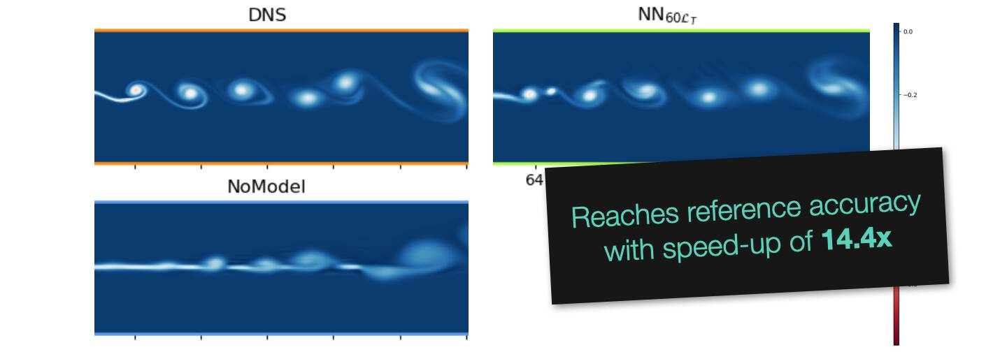

# Code repository for "Learned Turbulence Modelling with Differentiable Fluid Solvers"

This repository will contain the source code for 
["Learned Turbulence Modelling with Differentiable Fluid Solvers"](http://arxiv.org/abs/2202.06988) by Bjoern List, Liwei Chen, and Nils Thuerey.

## Abstract:

In this paper, we train turbulence models based on convolutional neural networks. These learned turbulence models improve under-resolved low resolution solutions to the incompressible Navier-Stokes equations at simulation time. Our method involves the development of a differentiable numerical solver that supports the propagation of optimisation gradients through multiple solver steps. We showcase the significance of this property by demonstrating the superior stability and accuracy of those models that featured a higher number of unrolled steps during training. This approach is applied to three two-dimensional turbulence flow scenarios, a homogeneous decaying turbulence case, a temporally evolving mixing layer and a spatially evolving mixing layer. Our method achieves significant improvements of long-term a-posteriori statistics when compared to no-model simulations, without requiring these statistics to be directly included in the learning targets. At inference time, our proposed method also gains substantial performance improvements over similarly accurate, purely numerical methods.

[TUM](https://ge.in.tum.de/)
